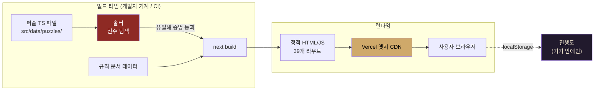
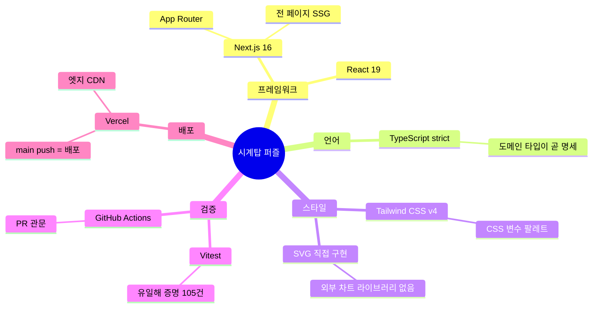
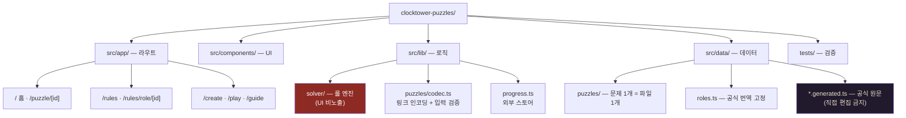
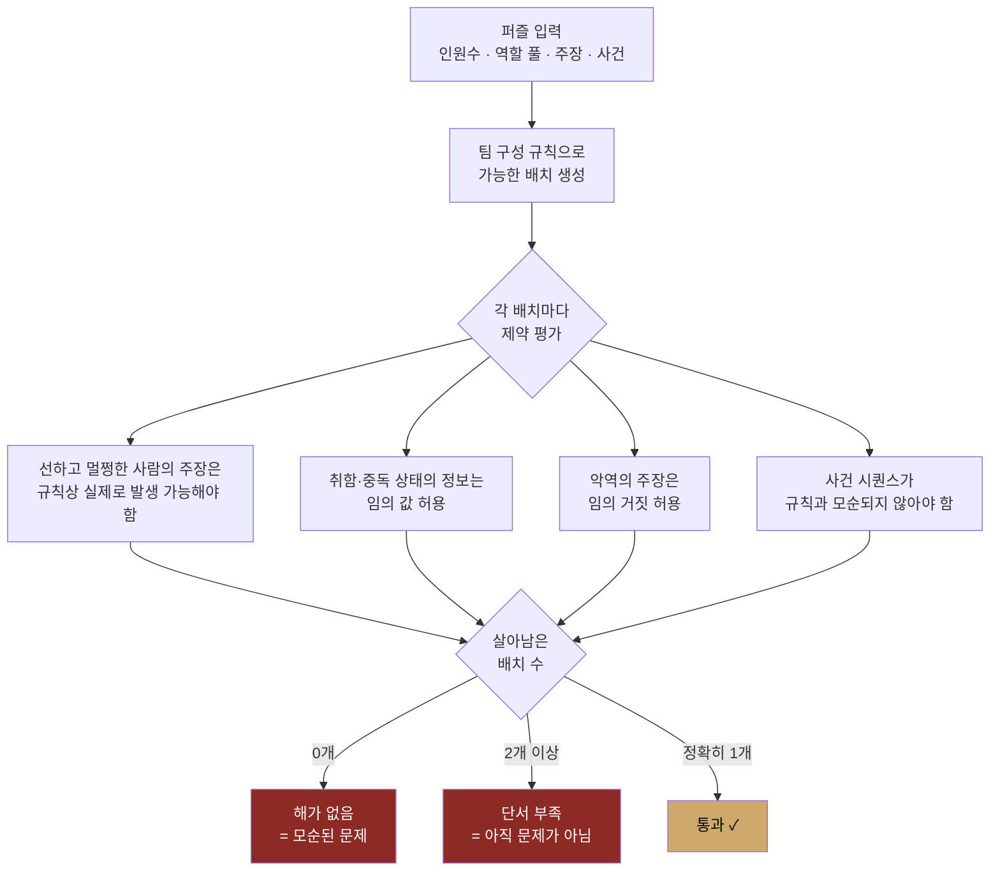
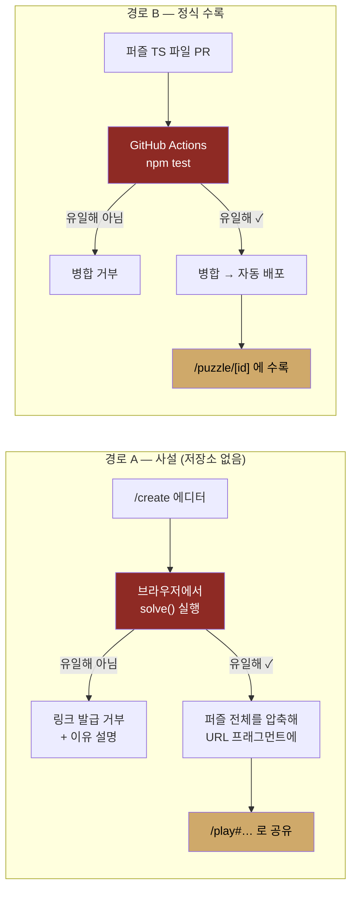
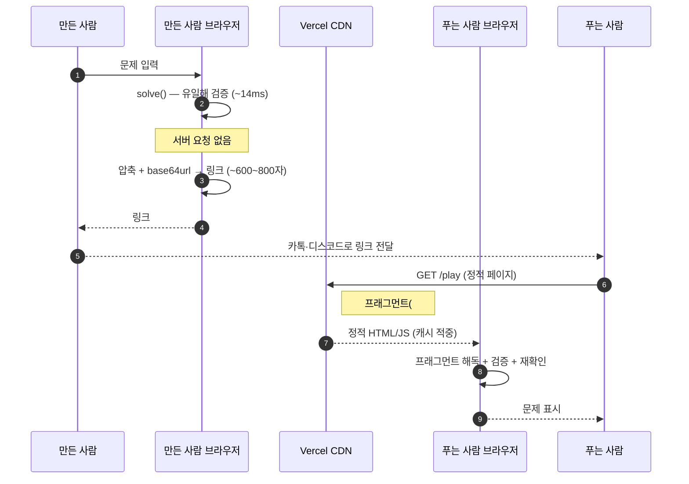
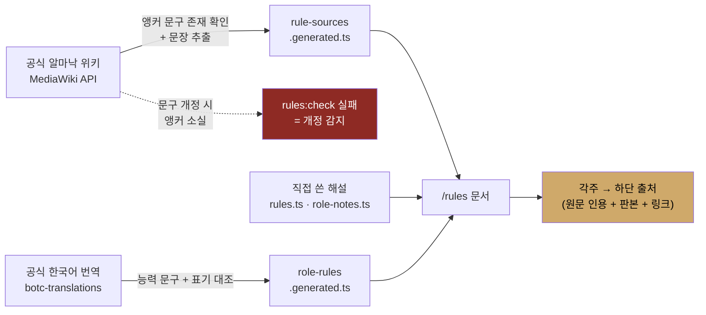
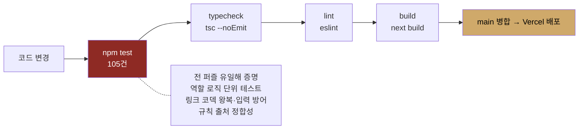

# 기술 스택과 구조

> 글로 된 설계는 [ARCHITECTURE.md](./ARCHITECTURE.md), 요구사항은 [REQUIREMENTS.md](./REQUIREMENTS.md).
> 이 문서는 같은 내용을 **그림으로** 본다. (GitHub이 Mermaid를 바로 렌더링한다.)

## 1. 한눈에 — 전부 정적이다

서버 라우트도, API도, 데이터베이스도, 환경변수도 없다.
빌드가 끝나면 남는 것은 정적 파일뿐이고, 실행 중인 서버 코드는 존재하지 않는다.

**서버가 하는 일은 정적 파일 전송뿐이다.** 100 동시 연결 부하 테스트에서 홈 4,500 req/s,
퍼즐 페이지 3,450 req/s, 에러 0건이었다 (p99 ≤ 53ms).

## 2. 기술 선택

런타임 의존성은 `next`, `react`, `react-dom` **셋뿐이다.**

## 3. 디렉터리 구조

## 4. 솔버 — 이 프로젝트의 심장

목적은 하나다. **답이 정확히 하나임을 증명하는 것.**

> **중요한 미묘함:** 취하거나 중독된 사람의 정보는 "거짓"이 아니라 **"임의"** 로 다뤄야 한다.
> 공식 규칙상 텔러는 아무 정보나 줄 수 있고, 우연히 참일 수도 있다. 이를 "거짓"으로
> 모델링하면 실제로는 답이 여럿인 문제를 유일해로 잘못 통과시킨다.

**성능 (실측):** 기존 퍼즐 0.4\~6ms. 최악의 경우(10인·역할풀 18종) 14ms.
밤 수를 12로 늘려도 13ms — 솔버가 10인을 상한으로 두어 탐색 공간이 유계이기 때문이다.
그래서 **브라우저에서 그대로 돌릴 수 있다.**

## 5. 두 종류의 퍼즐, 같은 관문

난이도(쉬움·보통·어려움)와 출처(수록·사설)는 **직교하는 축**이다.
사설 문제도 어려울 수 있으므로 난이도 값에 "사설"을 섞지 않는다.

## 6. 사설 문제는 왜 서버에 부하를 주지 않는가

**업로드라는 행위 자체가 없다.** 문제는 링크 그 자체다.

그래서 **동시에 몇 명이 문제를 만들든 서버가 하는 일은 정적 페이지 서빙뿐이다.**
업로드 엔드포인트가 없으니 스팸·모더레이션·삭제 요청 문제도 애초에 생기지 않는다.
대가는 목록·검색이 없다는 것 — 링크를 잃으면 문제도 사라진다.

**신뢰 경계:** 링크는 외부 입력이므로 신뢰하지 않는다. `codec.ts`의 `validateShared()`가
좌석 범위·역할 id·길이 상한·구조를 전수 검사하고, 통과한 뒤에도 브라우저가 유일해를
다시 확인해 사용자에게 알린다.

## 7. 규칙 문서 — 공식 원문과 자동 대조

해설은 직접 쓰되, **모든 서술에 공식 원문 근거를 붙여** 독자가 정합성을 확인할 수 있게 한다.

`npm run rules:check` 가 인용이 지금도 원문 그대로인지 대조한다.
공식 문구가 바뀌어 앵커가 사라지면 **실패로 끝나** 규칙 개정을 놓치지 않는다.

## 8. 품질 게이트

네 단계 모두 `.github/workflows/ci.yml` 에서 push·PR마다 자동 실행된다.
**퍼즐 유일해 검증이 깨지면 병합되지 않는다** — 외부 기여(경로 B)의 관문이다.
